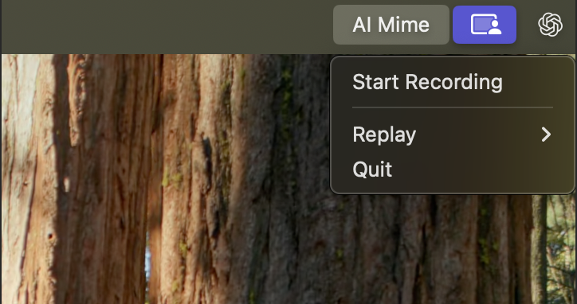
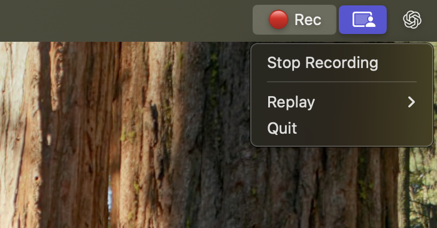

# AI Mime

**Record, Reflect, and Replay workflows on macOS.**
A macOS desktop RPA tool for end-to-end workflow automation.
It records user interactions (mouse, keyboard, window/app context) and replays them to rerun tasks on demand—great for repeatable, multi-step processes across native macOS apps and websites.

## Record
Start capturing a workflow by clicking AI Mime → Start Recording in the macOS menu bar. When you’re done, click AI Mime → Stop Recording to save it.

  

## Replay

To run a saved workflow, open AI Mime → Replay, choose a workflow from the dropdown, enter the new parameters, and click Run. The workflow will execute automatically—no manual intervention needed.


## Installation

1.  Clone the repository.
2.  Create and activate a virtual environment:
    ```bash
    python3 -m venv .venv
    source .venv/bin/activate
    ```
3.  Install dependencies:
    ```bash
    pip install -e .
    ```

## Permissions (Critical)

To function correctly, `ai-mime` requires macOS permissions. Because you are likely running this from a Python virtual environment, you must grant permissions to the **Python binary** inside your `.venv`.

1.  **Run `start_app` once**: The app will attempt to check permissions and may trigger a system prompt.
2.  **Open System Settings**: Go to **Privacy & Security**.
3.  **Grant Permissions**:
    *   **Accessibility**: Required to monitor global mouse/keyboard inputs. Add your Terminal app (e.g., iTerm, Terminal) AND the python binary from your venv if prompted.
    *   **Screen Recording**: Required to capture screenshots. Add your Terminal app / Python binary.
    *  **Input Monitoring**

Use Cmd+Shift+G when trying to add the python binary in settings.

*Note: If you see "Terminal" in the list but it still doesn't work, try removing it and re-adding it, or run the script from a dedicated terminal window.*

## Environment keys (.env)

Create a `.env` file (or export env vars) with:

```bash
OPENAI_API_KEY=
DASHSCOPE_API_KEY=
GEMINI_API_KEY=
REPLAY_PROVIDER=
REPLAY_MODEL=
LMNR_PROJECT_API_KEY=
```

and add it in the repo root
- `OPENAI_API_KEY`: used for schema compilation (reflect).
- `DASHSCOPE_API_KEY`: used for replay action grounding via DashScope’s OpenAI-compatible endpoint (default). Get it from here [alibaba cloud](https://modelstudio.console.alibabacloud.com/)
- `GEMINI_API_KEY`: used for replay grounding when configured to use Gemini’s OpenAI-compatible endpoint (see below). Docs: [Gemini OpenAI compatibility](https://ai.google.dev/gemini-api/docs/openai)
- `REPLAY_PROVIDER`: selects the grounding provider: `openai`, `gemini`, or `qwen`.
- `REPLAY_MODEL`: grounding model name for the selected provider (e.g. `gpt-4o-mini`, `gemini-3-*`, `qwen3-vl-*`).
- `LMNR_PROJECT_API_KEY`: used for Laminar tracing/telemetry (if enabled in your environment) (Optional) [Link](https://laminar.sh/).

## Usage

### Start app (record + replay UI)

Start the menubar app:

```bash
source .venv/bin/activate
start_app
```

PS: The app creates a lot of processes in the background. These might persist on quitting the app. The following command to force kills all these processes:
```
pkill -9 -f "ai_mime\.cli:start_app|ai_mime\.app|start_app|AI Mime"
```

#### Start recording
- In the menubar app, click **Start Recording**.

#### During recording
- **Captured inputs**: clicks, scrolls, typing bursts, and special keys (`Enter`, `Tab`, `Esc`, `Cmd+Space`).

#### Stop recording
- Click **Stop Recording**.
- The recorder stops immediately.
- **Reflect runs in the background**: it converts the raw recording into a workflow under `workflows/<session_id>/` and compiles `schema.json` (so you can replay). Do not terminate the process as Reflect runs in the background and takes some time to execute.

#### Replay a specific recording
- Open the menubar app → **Replay** → choose the workflow you want to run (workflows are discovered by scanning `workflows/` for folders that contain `schema.json`).

#### Edit a workflow (browser editor)
- Open the menubar app → **Edit Workflow** → choose a workflow.
- Your default browser will open a local editor page (served from `127.0.0.1`).
- You can edit:
  - task name + detailed task description
  - parameters (add/delete; deleted params can be “baked in” using their example value on save)
  - subtasks (add/insert anywhere/delete)
  - steps (edit intent/action_type/action_value; delete steps)
  - dependencies (pick upstream `extract_*` variables)
  - advanced step details via **Details** (expected state, target, post_action, extract fields)
- Click **Save** to validate + write back to `workflows/<session_id>/schema.json`. If invalid, the editor shows the error and does not save.

### Output

#### Record output
Recordings are saved in `recordings/<session_id>/`:
-   `manifest.jsonl`: Event log (Action + Screenshot + Voice).
-   `metadata.json`: Session info.
-   `screenshots/`: Image files (0.png, 1.png...).
-   `audio/`: Voice clips (0.wav, 1.wav...).

#### Reflect output
Workflows are saved in `workflows/<session_id>/`:
- `manifest.jsonl`: Cleaned manifest for replay/compilation.
- `metadata.json`: Copied session metadata.
- `screenshots/`: Screenshots copied into the workflow.
- `schema.json`: The final, replayable plan schema.

### CLI: Reflect

If you want to run reflect manually on an existing recording:

```bash
reflect --session <session_id>
```


## Glossary

- **Record**: capture a live session into `recordings/<session_id>/` (events + screenshots + audio).
- **Reflect**: transform a recording into a reusable workflow under `workflows/<session_id>/` and compile `schema.json`.
- **Replay**: execute `schema.json.plan.steps` on macOS; the model predicts the concrete GUI actions each step using the current screenshot.

## Replay (Run a workflow)

To run an existing workflow:

1. In the menubar app, open **AI Mime → Replay**.
2. Select a workflow from the dropdown.
3. If the workflow defines parameters, fill them in.
4. Click **Run** to start replaying the workflow.
