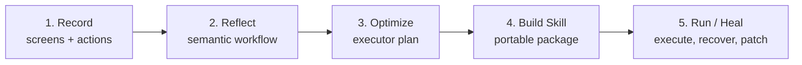

<div align="center">
  

# ai_mime
Automate anything you can demonstrate.

Record a workflow once. ai_mime turns the captured screenshots and actions into
semantic workflow artifacts, optimizes the execution path, packages the result
as a Claude Skill-compatible portable skill, and runs it with new inputs. When a
run breaks, an agent can finish the job and patch the skill instead of leaving a
failed replay behind.

[Install](#installation) · [Quick Demo Flow](#quick-demo-flow) · [How it works](#how-it-works) · [Developer guide](docs/developer-guide.md) · [Community](#community)

**Download the Desktop App:** [AI.Mime.dmg](https://github.com/prakhar1114/ai_mime/releases/latest/download/AI.Mime.dmg)

💬 [Join the Discord](https://discord.gg/ghAWAJsB)

</div>

## Getting Started
The fast path for cloning, configuring, and running ai_mime locally.

### Requirements
- **OS**: macOS 13+ (Windows support not yet available)
- **Runtime**: Python `>= 3.12, < 3.13`
- **System permissions**: Accessibility, Screen Recording, and Input Monitoring
- **Agent runtime**: Anthropic / Claude Code or OpenAI / Codex through the onboarding wizard. Custom providers can be configured through `user_config.yml`.

### Installation
```bash
git clone --recurse-submodules https://github.com/prakhar1114/ai_mime
cd ai_mime

uv venv .venv
source .venv/bin/activate
uv pip install -e .

# Required for browser automation skills.
uv tool install --python .venv/bin/python --with-editable packages/llm-resolver harness/browser-harness
```

Prefer not to build from source? Grab the prebuilt [Desktop App](#desktop-app).

### Configuration
You do **not** need to manually create `.env` or `user_config.yml` for the normal setup path.

On first launch, the native macOS onboarding wizard guides you through:
1. Granting Accessibility and Screen Recording permissions.
2. Selecting Anthropic / Claude Code or OpenAI / Codex.
3. Saving API keys or detecting a local CLI login.
4. Installing the app-managed browser harness.

You can update provider settings later from the dashboard.

## Quick Demo Flow
Start the app:
```bash
source .venv/bin/activate
start_app
```

Then use the menu bar app or dashboard:
1. **Record**: click **Start Recording** and perform a repetitive task once.
2. **Reflect**: ai_mime compiles the captured trace into a reusable semantic workflow.
3. **Build Skill**: the build agent confirms inputs and outputs, optimizes the execution plan, and creates a portable skill under `workflows/<id>/skills/<slug>/`.
4. **Run**: open **Replay**, provide new inputs, and run the skill.
5. **Inspect**: read the generated artifacts and run history from the `workflows/` directory.

### Artifacts You Can Inspect
| Path | What it contains |
| --- | --- |
| `recordings/<id>/manifest.jsonl` | Raw captured event stream: screenshots, clicks, typing, hotkeys, extracts, and notes. |
| `workflows/<id>/schema.json` | Coordinate-free semantic workflow generated from the recording. |
| `workflows/<id>/optimized_plan.json` | Executor plan that chooses `script`, `browser_harness`, or `ui_agent` steps. |
| `workflows/<id>/skills/<slug>/` | Claude Skill-compatible portable package with `run.sh`, `scripts/run.py`, inputs, and fallback references. |
| `workflows/<id>/runs/` | Per-run logs, outputs, copied assets, and replay summaries. |

## Desktop App
A packaged desktop app with no source build step is available for macOS.

**Download**: [AI.Mime.dmg](https://github.com/prakhar1114/ai_mime/releases/latest/download/AI.Mime.dmg)  
**Platforms**: macOS

After downloading, drag the app to Applications and grant the requested permissions on launch.

## When To Use ai_mime
ai_mime is for work that is easier to show than to describe:
- Data entry across internal tools, spreadsheets, and web portals.
- Pulling reports from systems with weak or missing APIs.
- Browser + native macOS workflows that normal automation tools cannot cover cleanly.
- Repetitive tasks where a human should define the workflow once, then review outputs as needed.

It is not the right fit yet for open-ended research, creative generation, fully autonomous decisions, or scheduled cron-style jobs.

## What Is Novel Here?
- **Semantic trace compilation**: a demonstrated UI trace becomes coordinate-free task steps, not brittle x/y replay.
- **Intent optimization**: the system can replace manual UI paths with APIs, CLI calls, file parsing, browser CDP automation, or native UI automation depending on what is most reliable.
- **Portable executable skills**: every finished automation is readable code plus a JSON input contract and fallback context.
- **Agentic healing**: failed runs can be triaged, completed, and patched so the next run is deterministic again.

## How It Works

```mermaid
graph LR
    A["1. Record<br/>screens + actions"] --> B["2. Reflect<br/>semantic workflow"]
    B --> C["3. Optimize<br/>executor plan"]
    C --> D["4. Build Skill<br/>portable package"]
    D --> E["5. Run / Heal<br/>execute, recover, patch"]
```

- **Record** captures clicks, keystrokes, screenshots, extracts, and user notes into `recordings/<id>/`.
- **Reflect** converts the trace into a reusable `schema.json` with task parameters, subtasks, and coordinate-free steps.
- **Optimize** writes `optimized_plan.json`, preferring deterministic `script` steps, then `browser_harness`, then `ui_agent` for true GUI-only work.
- **Build Skill** creates a portable skill package with `run.sh`, `scripts/run.py`, input templates, and `references/fallback_plan.md`.
- **Run / Heal** executes the skill with new inputs. If it fails, the replay agent can inspect logs, complete the run, and repair the skill.

Because the generated package is executable and readable, you can also expose the skill directory to Claude Code or Codex and let terminal agents call the automation directly.

## Background
Every repetitive task you do on a screen is programming you are doing by hand. Existing automation tools usually force you into a different grammar:

- **Zapier / Make** need triggers and field maps, and only work where APIs exist.
- **Node-based builders** can be powerful, but the interface becomes the work.
- **RPA** often depends on brittle selectors and specialized implementation effort.
- **Computer-use agents** can reach more surfaces, but they re-solve the task every run.

ai_mime uses a deterministic-first, agent-on-fallback hybrid: scripts for the repeatable spine, LLM calls for bounded judgment, browser harnesses for web automation, and native computer-use only where the task genuinely needs it.

## What It Can And Cannot Do Today
**Great at**
- Repetitive, demonstrable tasks.
- Tasks that touch web portals, spreadsheets, files, and legacy desktop apps.
- Workflows where the common path should run fast but recovery matters.
- Human-in-the-loop workflows where outputs should be reviewed before the next step.

**Not for yet**
- Answering arbitrary questions or generating reports/images from scratch.
- Open-ended judgment or high-stakes decisions.
- Anything you cannot demonstrate roughly the same way twice.
- Scheduling and webhooks.

Rule of thumb: redundant in, creative out. If you would do it the same way every time, it belongs here. Judgment stays with you.

## Why Open Source
This product records what you do and runs scripts on your machine, touching sensitive software. "Trust us" is not enough.

- **Self-hosted and inspectable**: see what is captured and what runs.
- **Skills are yours**: automations are readable portable packages, not hostage data.
- **AGPLv3**: the open-source core and skill format stay shareable.

## Developer Docs
- [Developer guide](docs/developer-guide.md): setup, package layout, commands, runtime environment, and manual skill execution.
- [Architecture](docs/architecture.md): current Record -> Reflect -> Optimize -> Build Skill -> Run/Heal pipeline.

## Roadmap
ai_mime is the single-operator core of a larger executable playbook layer for teams.

- [ ] Visual flowchart view of each skill
- [ ] Shared team library + forking
- [ ] Skill marketplace
- [ ] Scheduling, webhooks, natural-language triggers
- [ ] Human-in-the-loop gates for irreversible actions

## Community
- 💬 **Discord**: [Join the ai_mime Community](https://discord.gg/ghAWAJsB)
- 🐛 **Issues**: open one on GitHub with broken runs, logs, or reproduction details
- ⭐ **Star the repo** if you want to follow along
