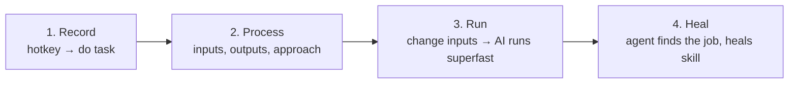

<div align="center">
  

# ai_mime
Automate anything you can demonstrate.

Show a task once. ai_mime learns it, stores it as a **Claude Skill** (comprising a fast deterministic script, learned task context, and domain gotchas), and runs it forever. Next time just change the inputs and watch AI do the work at script speed. When something breaks, an agent finishes the job and heals the skill instead of failing.

[Install](#installation) · [Configuration](#configuration) · [Usage](#usage) · [Desktop App](#desktop-app) · [How it works](#how-it-works) · [Community](#community)

**Download the Desktop App:** [AI.Mime.dmg](https://github.com/prakhar1114/ai_mime/releases/latest/download/AI.Mime.dmg)

💬 [Join the Discord](https://discord.gg/ghAWAJsB)

</div>

## Getting started
The fast path for cloning, configuring, and running ai_mime locally. If you'd rather understand what it is and why first, jump to [How it works](#how-it-works).

### Requirements
- **OS**: macOS 13+ (Windows support not yet available)
- **Runtime**: Python `>= 3.12, < 3.13`
- **System Permissions**: Accessibility, Screen Recording, and Input Monitoring
- **AI Provider**: An API key for your preferred agent/healing layer (e.g., Anthropic, OpenAI, Gemini, DashScope). Alternatively, since skills are portable scripts, you can seamlessly trigger them using your own local `claude code` or `codex` CLI tools.

### Installation
```bash
git clone --recurse-submodules https://github.com/prakhar1114/ai_mime
cd ai_mime

# Create a virtual environment and activate it
uv venv .venv
source .venv/bin/activate

# Install the app and its dependencies
uv pip install -e .

# Install the browser-harness tool (required for web automation)
uv tool install --python .venv/bin/python --with-editable packages/llm-resolver harness/browser-harness
```
Prefer not to build from source? Grab the prebuilt [Desktop App](#desktop-app).

### Configuration
You do **not** need to manually create or edit `.env` or `user_config.yml` files.

When you launch the app for the first time, the native macOS **Onboarding Wizard** will automatically guide you through:
1. Granting necessary macOS Accessibility and Screen Recording permissions.
2. Selecting your AI Provider and securely saving your API keys.

You can update these preferences at any time directly through the **Settings** tab in the Web Dashboard (accessible via the Menu Bar).

### Usage
Start the app:
```bash
source .venv/bin/activate
start_app
```
Then, from your macOS Menu Bar:

1. **Record** — Click **Start Recording** and perform your task once.
2. **Confirm** — The AI reads back its understanding in an interactive chat. It asks clarifying questions to verify the inputs, outputs, and approach before generating the code. It then saves the task as a Claude Skill.
3. **Run** — Re-run with new inputs from the **Replay** menu item. Watch the AI execute it at script speed while the Automation Overlay keeps you informed.

See [How it works](#how-it-works) for the full model, and [What it can & can't do](#what-it-can--and-cant--do-today) before you pick a first task.

## Desktop App
A packaged desktop app (no build step required) is available for macOS.

**Download**: [AI.Mime.dmg](https://github.com/prakhar1114/ai_mime/releases/latest/download/AI.Mime.dmg)
**Platforms**: macOS

*After downloading, drag the app to your Applications folder and grant the requested accessibility and screen recording permissions on launch.*

---

## Background

### The problem
Every repetitive task you do on a screen is programming you're doing by hand, every day. The tools meant to fix this all make you translate your work into their grammar:

- **Zapier / Make** want triggers and field maps — and only work where there's an API.
- **n8n / Node-based builders** are harder to understand and get started with. ai_mime gives you deterministic scripts without the cost of learning a complex node interface, and is fully agentic with high coverage across your entire system's context.
- **RPA** (UiPath etc.) wants brittle selectors and an RPA developer — and shatters the moment a button moves.
- **Computer-use agents** (Operator, etc.) re-figure-out the whole task from scratch on every run — slow, expensive, and never quite reliable.

ai_mime is the only interface where the skill needed to use it is the skill you already have to do the job. You don't describe the task. You do it, once.

### Why this is different
Record-and-replay has been promised for 30 years (Sikuli, iMacros, early RPA) and always broke. Two things changed in the last year that make it actually work now:

1. Models can read a screen the way a human does — semantically, not by brittle selectors.
2. When the script breaks, an agent recovers it — closing the reliability gap that killed every previous attempt.

Computer-use agents reach surfaces nothing could automate before — so coverage extends past anything with an API or a stable DOM, right down to legacy desktop apps. The work runs native to your own system, not in someone else's cloud.

The split that makes it work: deterministic code for the repeatable spine, an LLM for the small judgment calls, and a computer-use agent for the parts that genuinely can't be scripted. Most tools pick exactly one of those and break on the other two.

So ai_mime runs a deterministic-first, agent-on-fallback hybrid: a fast, cheap, repeatable skill for the common path; an agent that steps in only when something breaks, finishes the run, and heals the skill so the next run is fast again.

Try this: record a task, then run it with different inputs. The first run you do by hand; every run after is the AI doing it in seconds. Now change the website mid-run and watch the agent recover and re-learn the broken step live. That moment is the whole product.

## How it works

```mermaid
graph LR
    A[1. Record<br>hotkey → do task] --> B[2. Process<br>inputs, outputs, approach]
    B --> C[3. Run<br>change inputs → AI runs superfast]
    C --> D[4. Heal<br>agent finds the job, heals skill]
```

- **Record** — hit a global hotkey and just do the task. ai_mime captures clicks, keystrokes, and screen state.
- **Process** — Processes the recording, understands the context of the task end-to-end, confirms the inputs, outputs, and approach, then learns how to do the task end-to-end in the optimized way, preferring `bash` > `browser_harness` > `cua_agent` in that order. The result is stored as a Claude Skill.
- **Run** — next time, just change the inputs. The skill replays the work at script speed — this is where you see the magic of AI doing in seconds what took you minutes. Trigger it manually or in natural language.
- **Heal** — if a run fails, it falls back to an agent that finishes the task anyway, then heals the underlying skill so the next run is fast and deterministic again.

You define intent once. After that, the system owns the work.

### The Anatomy of a Claude Skill
Recordings aren't trapped in a proprietary format — each one is packaged as a standard, portable **Claude Skill**. A skill directory includes:
- **`run.sh` / `scripts/run.py`**: The fast, deterministic executable code.
- **`inputs.json`**: The standard JSON contract for runtime arguments.
- **`references/`**: Rich contextual notes, domain gotchas, and a visual `fallback_plan.md`.

Because every skill is just a UNIX executable with a standard contract, you can expose your `skills/` folder directly to **Claude Code** or **Codex**. This gives those text-based terminal agents the superpower to drive your native macOS GUI or navigate complex web portals simply by calling the script!

### Agentic Healing & Editing
ai_mime doesn't just run rigid scripts. During a replay, if the `run.sh` script breaks (e.g., a website's UI changed completely), the orchestration engine triggers **Agentic Healing**:
1. A triage agent takes over and reads the execution logs alongside the `fallback_plan.md`.
2. It spins up the UI Agent to finish the job visually via the native macOS interface.
3. It permanently patches the underlying Python script to heal the skill for all future runs.

Editing is entirely conversational: rather than dragging nodes in a visual builder, you just talk to the agent to adjust inputs, handle new task variants, or fix edge cases.

## What it can — and can't — do today
We'd rather you trust this README than be disappointed by the product. Honest scope:

**Great at**
- Repetitive, demonstrable tasks: data entry, moving things between systems, pulling reports, filling forms, multi-app workflows across web + legacy desktop apps.
- Tasks that are easier to show than to describe.
- Re-running the same task reliably, fast, many times.
- Decomposing a big task into automatable pieces with a human in the loop — the agent pauses at output checkpoints for you to review, and you trigger the next workflow when you're ready.

**Not for (yet)**
- Answering questions or generating reports/images from scratch.
- Open-ended judgment or decision-making by conversation.
- Anything you can't demonstrate the same way twice.
- Scheduling / cron jobs — runs are triggered manually or in natural language for now.

The rule of thumb: redundant in, creative out. If you'd do it identically every time, it belongs here. Judgment stays with you.

## Why open source
This product records what you do and runs scripts on your machine, touching your most sensitive software. "Trust us" isn't good enough. So:

- **Self-hosted and inspectable** — you can see exactly what's captured and what leaves your machine (nothing has to).
- **Skills are yours** — every task is stored as a portable Claude Skill you own and can read, edit, and share. Not hostage data in a proprietary format.
- **Licensed under AGPLv3** (the skill format stays open, so your automations are freely shareable).

## Roadmap
ai_mime is the single-operator core of a bigger idea: the executable playbook layer for a whole team — where a senior records a task once, the team forks and runs it, and the work becomes org property that outlives whoever wrote it.

- [ ] Visual flowchart view of each skill — see and approve the steps as an SOP, not code
- [ ] Shared team library + forking
- [ ] Skill marketplace (community-contributed automations)
- [ ] Scheduling, webhooks, natural-language triggers
- [ ] Human-in-the-loop gates for irreversible actions

Today the open-source core gives one person the power to capture and run their work. That part is free, forever.

## Community
- 💬 **Discord**: [Join the ai_mime Community](https://discord.gg/ghAWAJsB) — get help, share skills, tell us where a run broke.
- 🐛 **Issues**: open one on GitHub — broken runs are the single most useful thing you can send us right now.
- ⭐ **Star the repo** if you want to follow along.
