<div align="center">


# AI Mime

</div>

**Record, Refine and Replay on macOS.**
AI Mime is a native macOS RPA tool designed to empower computer use agents with the context they need to succeed. It moves beyond simple text prompts by capturing the rich ground truth required for reliable automation.

- Record: Capture every nuance of a workflow—mouse movements, keystrokes, and window states—providing the detailed ground truth that standard LLMs often lack.

- Refine: Leverage LLMs to transform raw recording data into parameterized agent instructions. This process converts static recordings into dynamic, manageable subtasks, allowing you to define inputs and dependencies that keep the agent operating within strict, observable boundaries.

- Replay: Dispatch computer use agents to execute complex, multi-step processes across native apps and the web on demand, ensuring high fidelity and repeatability.

<div align="center">

[](https://github.com/prakhar1114/ai_mime/releases/download/v1.0.0/AI.Mime.dmg)

</div>

## Demo

<table>
  <tr>
    <td align="center">
      <a href="https://www.youtube.com/watch?v=ppB4tbPc77U">
        
      </a>
      <br />
      <sub>End-to-end walkthrough (record → edit → replay)</sub>
    </td>
    <td align="center">
      <a href="https://youtu.be/gkqMfT_jE7U?si=KSuWr9zyhzPL1CMN">
        
      </a>
      <br />
      <sub>Automate expense sheet filing</sub>
    </td>
  </tr>
</table>

## Part 1: The Teaching Flow (Record & Refine)
How to Record a task

```mermaid
graph LR
    %% CAPTURE PHASE
    subgraph Capture [" 🔴 Phase 1: RECORD"]
        direction TB
        User["👤 User Action / Task"]

        subgraph Inputs ["Data Captured"]
            Mouse["🖱️ Coordinates (x,y)<br/>+ Click Events"]
            Keys["⌨️ Keystrokes<br/>(Text Input)"]
            Video["📷 Screenshot<br/>(Visual Context)"]
        end

        User --> Mouse & Keys
        User --> Video
    end

    %% TRANSFORMATION
    subgraph Refine [" 🟡 Phase 2: REFINE (Generalize) "]
        direction TB
        RawData[("📼 Raw Log")]
        LLM["🧠 AI Refiner<br/>(VLM)"]
        Schema[("📜 Parameterized<br/>Workflow JSON")]

        Mouse & Keys & Video --> RawData
        RawData -->|"1. Analyze Intent"| LLM
        LLM -->|"- Subtasks <br/>  - Task Parameters <br> - Task Dependencies"| Schema
    end

    %% STYLING
    style Inputs fill:#e3f2fd,stroke:#1565c0,stroke-dasharray: 5 5
    style Schema fill:#fff9c4,stroke:#fbc02d,stroke-width:2px
```


## Detailed Replay Flowchart (The Agentic Loop)

```mermaid
graph TD
    %% SETUP
    Start([🚀 Start Replay]) --> LoadJSON["📂 Load workflow.json"]
    LoadJSON --> InitMem["🧠 Initialize Context"]

    %% OUTER LOOP: ORCHESTRATOR
    subgraph FlowControl [" 📋 Workflow Orchestrator "]
        InitMem --> GetSubtask["📍 Get Next Subtask<br/>(e.g., 'Clear Search Field')"]
    end

    %% INNER LOOP: AGENTIC EXECUTION
    subgraph AgentLoop [" 🔁 The Agentic Action Loop "]
        direction TB

        %% 1. OBSERVE
        GetSubtask --> Capture["👁️ Capture State<br/>(Screenshot + DOM)"]

        %% 2. REASONING
        Capture --> VLM["🧠 VLM Reasoning<br/>(Input: Screen + Subtask + History)"]

        %% 3. DECISION POINT
        VLM --> Decision{❓ Prediction Result}

        %% PATH A: DO WORK (Not Done Yet)
        Decision -- "Next Action (x,y)" --> Execute["🦾 Execute Action<br/>(Click / Type / Scroll)"]
        Execute --> UpdateMem["💾 Update Memory<br/>(Store Action & Consequence)"]
        UpdateMem --> Capture

        %% PATH B: SUBTASK COMPLETE
        Decision -- "✅ Subtask Done" --> CheckFlow{🏁 More Subtasks?}
    end

    %% FLOW CONTROL
    CheckFlow -- Yes --> GetSubtask
    CheckFlow -- No --> Finish([✅ Workflow Complete])

    %% STYLING
    classDef brain fill:#f3e5f5,stroke:#7b1fa2,stroke-width:2px;
    classDef sensor fill:#e1f5fe,stroke:#0288d1,stroke-width:2px;
    classDef memory fill:#fff9c4,stroke:#fbc02d,stroke-width:2px;

    class VLM brain;
    class Capture,Execute sensor;
    class UpdateMem,LoadJSON memory;
```



## Why AI Mime?

### The Adoption Gap in Computer Use Models
While the latest computer-use models have demonstrated significant improvements in general-purpose reliability and accuracy, they have yet to see widespread adoption in the Robotic Process Automation (RPA) industry. The primary bottleneck is not the model's intelligence, but the interface of current products.

The Context Problem Existing tools typically rely on users to describe tasks using simple natural language. However, standard text prompts are often too brief to capture the nuance of complex workflows.

- Example: A user might type "Download the monthly invoice," but fail to specify edge cases—such as what to do if the download button is disabled, or which date range to select if the default is incorrect.

When an agent operates with this "low-context" instruction over a long horizon, the probability of error compounds. Without strict boundaries, models may attempt to be "creative" in their problem-solving, leading to unpredictable behaviors that are unacceptable in enterprise automation.

### The AI Mime Solution - Rich Context & Repeatability
AI Mime bridges this gap by shifting from vague natural language to rich, demonstrated context. Instead of relying on a single long-horizon prompt, AI Mime allows you to:

- Capture Detailed Workflows: "Show" the agent exactly how to perform a task, capturing the precise steps and decision paths.

- Enforce Observability: Break down complex workflows into manageable subtasks, each grounded in high-quality examples.

- Eliminate Unwanted Creativity: By providing a strict chain of steps and rich context, the agent is constrained to operate exactly as instructed, ensuring it executes the workflow rather than "interpreting" it.

In short, AI Mime transforms abstract instructions into repeatable, observable, and error-resistant workflows, making computer-use agents viable for production RPA.

## Record
Start capturing a workflow by clicking AI Mime → Start Recording in the macOS menu bar. When you’re done, click AI Mime → Stop Recording to save it.

  

## Replay

To run a saved workflow, open AI Mime → Replay, choose a workflow from the dropdown, enter the new parameters, and click Run. The workflow will execute automatically—no manual intervention needed.


## Download

**Get the latest version for macOS:**

📦 [Download AI Mime.dmg (v1.0.0)](https://github.com/prakhar1114/ai_mime/releases/download/v1.0.0/AI.Mime.dmg)

Or view all releases: [GitHub Releases](https://github.com/prakhar1114/ai_mime/releases/tag/v1.0.0)

After downloading:
1. Open the DMG file
2. Drag AI Mime.app to your Applications folder
3. Launch AI Mime from Applications
4. Grant required permissions when prompted (Accessibility, Screen Recording, Input Monitoring)

## Installation (Development)

1.  Clone the repository.
2.  Create and activate a virtual environment:
    ```bash
    python3 -m venv .venv
    source .venv/bin/activate
    ```
3.  Install dependencies:
    ```bash
    pip install -e .
    ```

## Permissions (Critical)

To function correctly, `ai-mime` requires macOS permissions. Because you are likely running this from a Python virtual environment, you must grant permissions to the **Python binary** inside your `.venv`.

1.  **Run `start_app` once**: The app will attempt to check permissions and may trigger a system prompt.
2.  **Open System Settings**: Go to **Privacy & Security**.
3.  **Grant Permissions**:
    *   **Accessibility**: Required to monitor global mouse/keyboard inputs. Add your Terminal app (e.g., iTerm, Terminal) AND the python binary from your venv if prompted.
    *   **Screen Recording**: Required to capture screenshots. Add your Terminal app / Python binary.
    *  **Input Monitoring**

Use Cmd+Shift+G when trying to add the python binary in settings.

*Note: If you see "Terminal" in the list but it still doesn't work, try removing it and re-adding it, or run the script from a dedicated terminal window.*

## Configuration

### Model/provider config (`user_config.yml`)

Create `user_config.yml` in the repo root. This is the **single place** to choose:
- provider/model (via LiteLLM `model` string + optional `api_base`)
- per-provider `extra_kwargs` (e.g. reasoning controls)

Example: see [`user_config.yml`](user_config.yml) in this repo.

### Secrets (`.env`)

Create a `.env` file (or export env vars) with only your API keys:

```bash
OPENAI_API_KEY=
LMNR_PROJECT_API_KEY=
```

and add it in the repo root
- `OPENAI_API_KEY`: used when `user_config.yml` points to `api_key_env: OPENAI_API_KEY`.
- `DASHSCOPE_API_KEY`: used when `user_config.yml` points to `api_key_env: DASHSCOPE_API_KEY`. Get it from here [alibaba cloud](https://modelstudio.console.alibabacloud.com/)
- `GEMINI_API_KEY`: used when `user_config.yml` points to `api_key_env: GEMINI_API_KEY`. Docs: [Gemini OpenAI compatibility](https://ai.google.dev/gemini-api/docs/openai)
- `LMNR_PROJECT_API_KEY`: used for Laminar tracing/telemetry (if enabled in your environment) (Optional) [Link](https://laminar.sh/).

## Usage

### Start app (record + replay UI)

Start the menubar app:

```bash
source .venv/bin/activate
start_app
```

PS: The app creates a lot of processes in the background. These might persist on quitting the app. The following command to force kills all these processes:
```
pkill -9 -f "ai_mime\.cli:start_app|ai_mime\.app|start_app|AI Mime"
```

#### Start recording
- In the menubar app, click **Start Recording**.

#### During recording
- **Captured inputs**: clicks, scrolls, typing bursts, and special keys (`Enter`, `Tab`, `Esc`, `Cmd+Space`).

#### Stop recording
- Click **Stop Recording**.
- The recorder stops immediately.
- **Reflect runs in the background**: it converts the raw recording into a workflow under `workflows/<session_id>/` and compiles `schema.json` (so you can replay). Do not terminate the process as Reflect runs in the background and takes some time to execute.

#### Replay a specific recording
- Open the menubar app → **Replay** → choose the workflow you want to run (workflows are discovered by scanning `workflows/` for folders that contain `schema.json`).

#### Edit a workflow (browser editor)
- Open the menubar app → **Edit Workflow** → choose a workflow.
- Your default browser will open a local editor page (served from `127.0.0.1`).
- You can edit:
  - task name + detailed task description
  - parameters (add/delete; deleted params can be “baked in” using their example value on save)
  - subtasks (add/insert anywhere/delete)
  - steps (edit intent/action_type/action_value; delete steps)
  - dependencies (pick upstream `extract_*` variables)
  - advanced step details via **Details** (expected state, target, post_action, extract fields)
- Click **Save** to validate + write back to `workflows/<session_id>/schema.json`. If invalid, the editor shows the error and does not save.

### Output

#### Record output
Recordings are saved in `recordings/<session_id>/`:
-   `manifest.jsonl`: Event log (Action + Screenshot + Voice).
-   `metadata.json`: Session info.
-   `screenshots/`: Image files (0.png, 1.png...).
-   `audio/`: Voice clips (0.wav, 1.wav...).

#### Reflect output
Workflows are saved in `workflows/<session_id>/`:
- `manifest.jsonl`: Cleaned manifest for replay/compilation.
- `metadata.json`: Copied session metadata.
- `screenshots/`: Screenshots copied into the workflow.
- `schema.json`: The final, replayable plan schema.

### CLI: Reflect

If you want to run reflect manually on an existing recording:

```bash
reflect --session <session_id>
```


## Glossary

- **Record**: capture a live session into `recordings/<session_id>/` (events + screenshots + audio).
- **Reflect**: transform a recording into a reusable workflow under `workflows/<session_id>/` and compile `schema.json`.
- **Replay**: execute `schema.json.plan.steps` on macOS; the model predicts the concrete GUI actions each step using the current screenshot.

## Replay (Run a workflow)

To run an existing workflow:

1. In the menubar app, open **AI Mime → Replay**.
2. Select a workflow from the dropdown.
3. If the workflow defines parameters, fill them in.
4. Click **Run** to start replaying the workflow.
