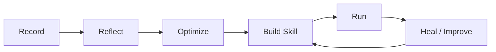

# Architecture

ai_mime turns a demonstrated workflow into a portable executable skill. The
current pipeline is:



## Record
The recorder captures the user demonstration as a session under
`recordings/<session_id>/`.

- `manifest.jsonl` stores an ordered event stream.
- Each event references a pre-action screenshot and action details.
- Screenshots capture the state before actions, so later stages can infer the
  user's intent without relying only on coordinates.
- `Ctrl + I` can add structured context:
  - `extract`: mark a value that should be read from the screen during replay.
  - `details`: attach free-form guidance to the next step.

Recordings are raw evidence. They are not the final automation.

## Reflect
Reflection converts the raw recording into workflow artifacts under
`workflows/<session_id>/`.

- The manifest and screenshots are copied into the workflow directory.
- Click screenshots are annotated for easier review.
- Pass A converts each action and surrounding screenshots into a coordinate-free
  step card: current state, intent, target, action value, and post-action result.
- Pass B groups step cards into a semantic `schema.json` with:
  - task description and success criteria
  - reusable task parameters
  - subtasks and plan steps
  - extract dependencies where needed

The result is a reusable description of what the user meant, not a literal
pixel replay.

## Optimize
Pass C creates `optimized_plan.json`, an executor-oriented strategy for actually
running the workflow.

Executors are chosen in this order:

1. `script`: deterministic Python, shell commands, APIs, file parsing,
   AppleScript, or bounded `ask_llm` decisions.
2. `browser_harness`: Chrome CDP automation through the bundled browser harness.
3. `ui_agent`: native macOS computer-use fallback for work that cannot be
   scripted or driven through the browser.

Optimization can collapse many recorded UI actions into one more reliable step.
For example, opening a PDF and copying text may become direct file parsing; a
long browser navigation may become a direct URL or CDP script.

## Build Skill
The build-skill chat turns the reflected workflow and optimized plan into a
Claude Skill-compatible package under:

```text
workflows/<session_id>/skills/<skill_slug>/
```

Required package shape:

```text
SKILL.md
run.sh
scripts/run.py
inputs/inputs.example.json
inputs/inputs.template.json
references/fallback_plan.md
```

The build agent verifies the task, writes durable notes, creates the skill, and
runs an end-to-end check before marking it ready.

Generated skills use the runtime contract exported by ai_mime:

- `AI_MIME_PYTHON_PATH`
- `AI_MIME_UV_PATH`
- `AI_MIME_BROWSER_HARNESS_BIN`
- `AI_MIME_BROWSER_SKILL_PATH`
- `AI_MIME_UI_AGENT_CMD`
- `AI_MIME_CONFIG_PATH`

## Run
The replay UI loads `inputs/inputs.template.json`, collects runtime values, and
executes the skill's `run.sh`.

During a run:

- Progress events are emitted as JSON on stderr.
- Outputs and changed assets are captured under `workflows/<id>/runs/<run_id>/`.
- `workflow_done` records the final structured outputs.
- `outputs/assets/` is used for files produced by the active workflow.

Developers can also run a skill manually:

```bash
cd workflows/<session_id>/skills/<skill_slug>
./run.sh inputs/inputs.example.json
```

## Heal And Improve
If direct execution fails, the replay agent can inspect:

- `SKILL.md`
- `run.sh`
- `scripts/run.py`
- `references/fallback_plan.md`
- run logs and outputs
- workflow schema and optimized plan

It first decides whether the failure is user state, environment, bad inputs,
transient UI state, or an actual skill defect. If the skill is defective, the
agent can patch the package and re-run validation so future executions return to
the deterministic path.
